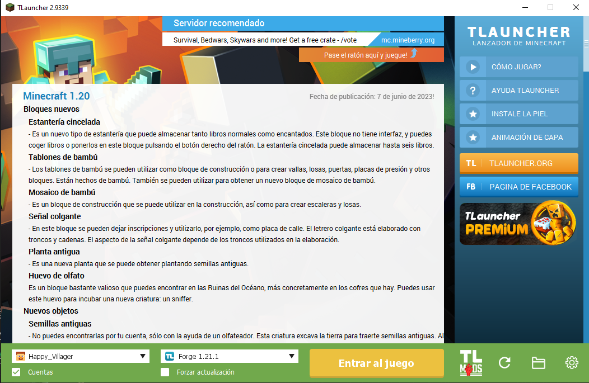
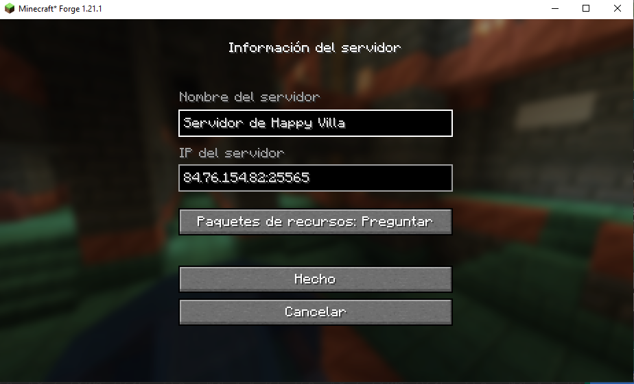
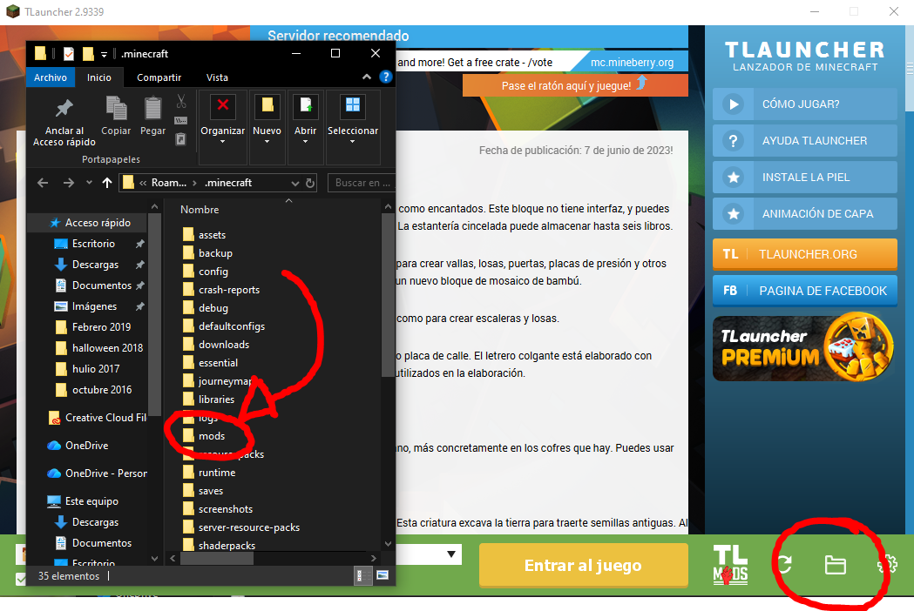
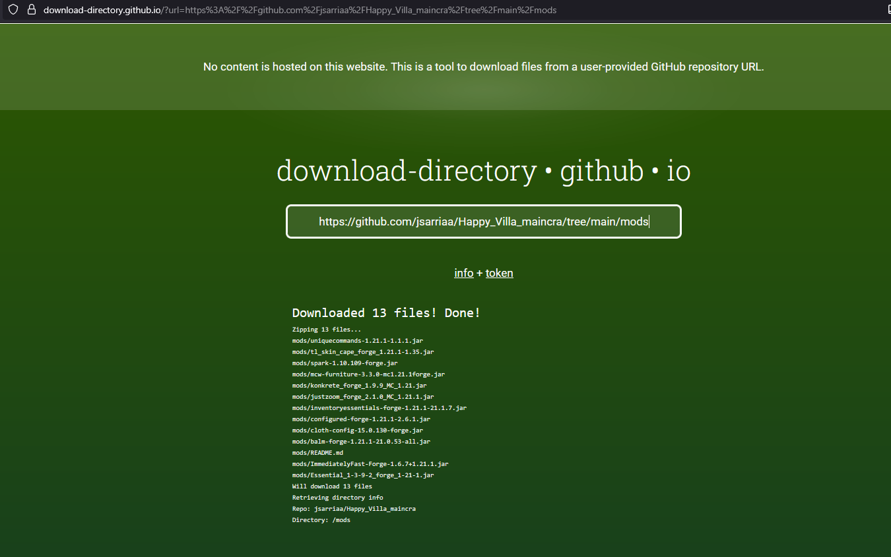
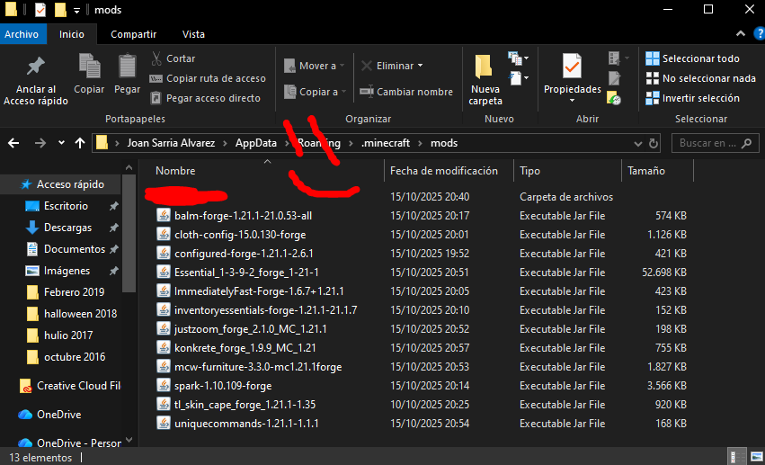

# How to Join the HAPPY VILLA Minecraft Multiplayer Server

## 🪟 Windows Users

### ✅ Step 1: Install TLauncher
- Download and install TLauncher from [https://tlauncher.org](https://tlauncher.org)
- Create a free TLauncher account or use your nickname
- Launch the app

### ✅ Step 2: Set Minecraft Version to Forge 1.21.10
- In the bottom-left of TLauncher, choose:
  - `Forge 1.21.10`
- Click **Enter the game** to install and launch


### ✅ Step 3: Join the Multiplayer Server
1. From the main menu, click **Multiplayer**
2. Click **Add Server**
3. Enter:
   - **Server Name:** Whatever you want (e.g. `Happy_Villa`)
   - **Server IP:** `84.76.154.82:25565`
4. Click **Done**
5. Select the server and click **Join Server**


### ⚠️ Mods
> NOW ARE NOT MODS ADDED, JUST VANILLA. SUGGESTIONS ARE WELCOME


You just need to download all files you find at [mods folder](https://github.com/jsarriaa/Happy_Villa_maincra/tree/main/mods), and open your local folder. Find it from TLauncher like this:


Do it going to this website: [https://download-directory.github.io/](https://download-directory.github.io/)

and pasting:
```https://github.com/jsarriaa/Happy_Villa_maincra/tree/main/mods```


Open the zip folder, and paste all files to the local folder, like this:



And initiate the server as normal

>  *NOTE* **Mods are ofc up to change. If any issue pops up with mods when logging into the server, just come to this website, download all mods again, empty your local folder and paste all news. This should fix any server update.**
>
> **And ofc, any suggestion is welcome!**

Find more info about which mods are added here: [MODS for Minecraft forge 1.21.1](https://github.com/jsarriaa/Happy_Villa_maincra/tree/main/mods#readme)
---

## 📱 Other Devices (Android/iOS)

> Work in progress – stay tuned!
