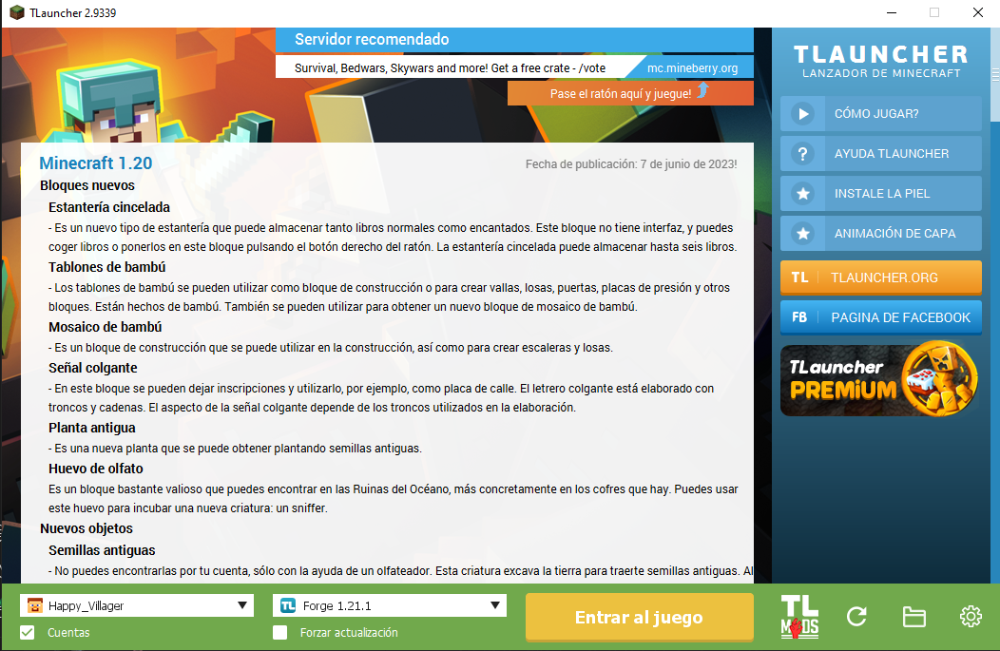
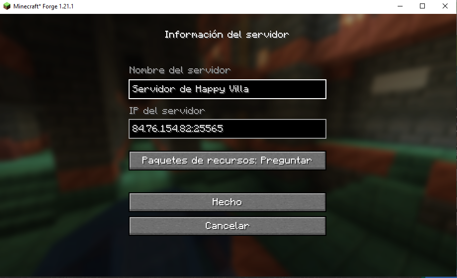

# How to Join the HAPPY VILLA Minecraft Multiplayer Server

## 🪟 Windows Users

### ✅ Step 1: Install TLauncher
- Download and install TLauncher from [https://tlauncher.org](https://tlauncher.org)
- Create a free TLauncher account or use your nickname
- Launch the app

### ✅ Step 2: Set Minecraft Version to Forge 1.21.1
- In the bottom-left of TLauncher, choose:
  - `Forge 1.21.1`
- Click **Enter the game** to install and launch

### ✅ Step 3: Join the Multiplayer Server
1. From the main menu, click **Multiplayer**
2. Click **Add Server**
3. Enter:
   - **Server Name:** Whatever you want (e.g. `Happy_Villa`)
   - **Server IP:** `84.76.154.82:25565`
4. Click **Done**
5. Select the server and click **Join Server**

### ⚠️ Mods
- Mods are **not added yet**. You can join without any mods for now.

---

## 📱 Other Devices (Android/iOS)

> Work in progress – stay tuned!
